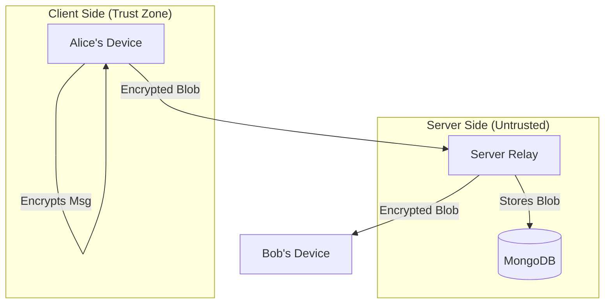

# SecureChannelX 🛡️

<div align="center">


**Military-Grade End-to-End Encrypted Messaging for the Post-Quantum Era.**

[Features](#-features) • [Architecture](#-architecture) • [Getting Started](#-getting-started) • [Security](#-security-deep-dive) • [Contributing](#-contributing)

</div>

---

## 📖 Overview

**SecureChannelX** is a cutting-edge messaging platform engineered to withstand the threats of tomorrow. While traditional apps rely on encryption standards that may be broken by future quantum computers, SecureChannelX integrates **NIST-standardized Post-Quantum Cryptography (Kyber512)** to ensure your data remains secure for decades to come.

Built with a **Zero-Knowledge** architecture, the server acts solely as a blind relay. It cannot read, modify, or analyze your messages.

---

## ✨ Features

### 🔐 Next-Gen Security
*   **True End-to-End Encryption (E2EE)**: Data is encrypted on the sender's device and decrypted only by the recipient.
*   **Post-Quantum Resistance**: Uses **Kyber512** for key encapsulation, neutralizing "Harvest Now, Decrypt Later" attacks.
*   **Forward Secrecy**: The **Double Ratchet** protocol rotates keys with every message. Compromising one key does not compromise past messages.
*   **Break-in Recovery**: The system automatically heals itself after a key compromise.

### 💬 Modern Messaging
*   **Real-Time Communication**: Instant message delivery via WebSocket.
*   **Group Encryption**: Efficient **Sender Keys** protocol allows for scalable, secure group chats.
*   **Encrypted File Sharing**: Share images and documents securely. Files are encrypted (AES-GCM) client-side before upload.
*   **Smart Previews**: Decrypts message previews locally for the chat list, keeping the server blind.

### 🛡️ Identity & Integrity
*   **Safety Numbers**: Verify contacts with a visual numeric fingerprint to detect Man-in-the-Middle (MITM) attacks.
*   **Secure Storage**: Keys are stored in **IndexedDB** (not LocalStorage) to prevent XSS extraction.
*   **Hardened Backend**: Protected by strict **CSP**, **Rate Limiting**, and **CORS** policies.

---

## 🏗 Architecture

SecureChannelX follows a client-heavy, server-blind architecture.



### The Stack
| Component | Technology | Purpose |
| :--- | :--- | :--- |
| **Frontend** | React, Vite, Tailwind | UI & Cryptographic Engine |
| **Backend** | Python (Flask), Socket.IO | Signaling, Auth, & Blob Storage |
| **Database** | MongoDB | Persistent Storage (Encrypted Data) |
| **Key Exchange** | X3DH + Kyber512 | Initial Session Setup |
| **Encryption** | AES-256-GCM | Message & File Encryption |

---

## 🚀 Getting Started

### Prerequisites
*   **Node.js** v16+
*   **Python** v3.9+
*   **MongoDB** (Local or Atlas)

### 1. Clone & Install
```bash
git clone https://github.com/Amitgupta0001/SecureChannelX.git
cd SecureChannelX
```

### 2. Backend Setup
```bash
cd backend
python -m venv venv
# Windows: venv\Scripts\activate | Mac/Linux: source venv/bin/activate

pip install -r requirements.txt

# Create .env file
echo "SECRET_KEY=dev_secret" > .env
echo "JWT_SECRET_KEY=dev_jwt_secret" >> .env
echo "MONGODB_URI=mongodb://localhost:27017/securechannelx" >> .env

python run.py
```
*Server runs on port `5050`*

### 3. Frontend Setup
```bash
cd frontend
npm install
npm run dev
```
*App runs on `http://localhost:5173`*

---

## 🔒 Security Deep Dive

### 1. The Double Ratchet
We use a custom implementation of the Double Ratchet algorithm.
*   **Root Chain**: Derived from the X3DH shared secret.
*   **Ratchet Steps**: Every message advances the chain, generating a unique Message Key.
*   **Header Encryption**: Message headers are encrypted to hide metadata where possible.

### 2. Post-Quantum Key Exchange (Kyber)
Standard Elliptic Curve (X25519) is vulnerable to Shor's Algorithm on quantum computers. We layer **Kyber512** (a lattice-based KEM) on top of X25519. An attacker must break **both** to compromise the session.

### 3. Client-Side File Encryption
Files are never sent as plaintext.
1.  Client generates a random 32-byte AES key.
2.  File is encrypted (AES-GCM) in the browser.
3.  Encrypted blob is uploaded.
4.  The AES key is sent to the recipient via the E2EE channel.

---

## 🧪 Verification

Don't just take our word for it. Verify the security yourself:

1.  **Network Inspection**: Open DevTools > Network. Observe that all `/api/messages` payloads are encrypted blobs.
2.  **Storage Check**: Open Application > IndexedDB. Confirm keys are stored securely and not in LocalStorage.
3.  **Safety Check**: Compare Safety Numbers with a friend. They should match exactly.

---

## 🤝 Contributing

We welcome contributions from security researchers and developers!

1.  Fork the repository.
2.  Create a feature branch (`git checkout -b feature/AmazingFeature`).
3.  Commit your changes.
4.  Push to the branch.
5.  Open a Pull Request.

---

## 📄 License

Distributed under the **MIT License**. See `LICENSE` for more information.

---

<p align="center">
  <b>SecureChannelX</b> — Privacy is a Human Right.
</p>
