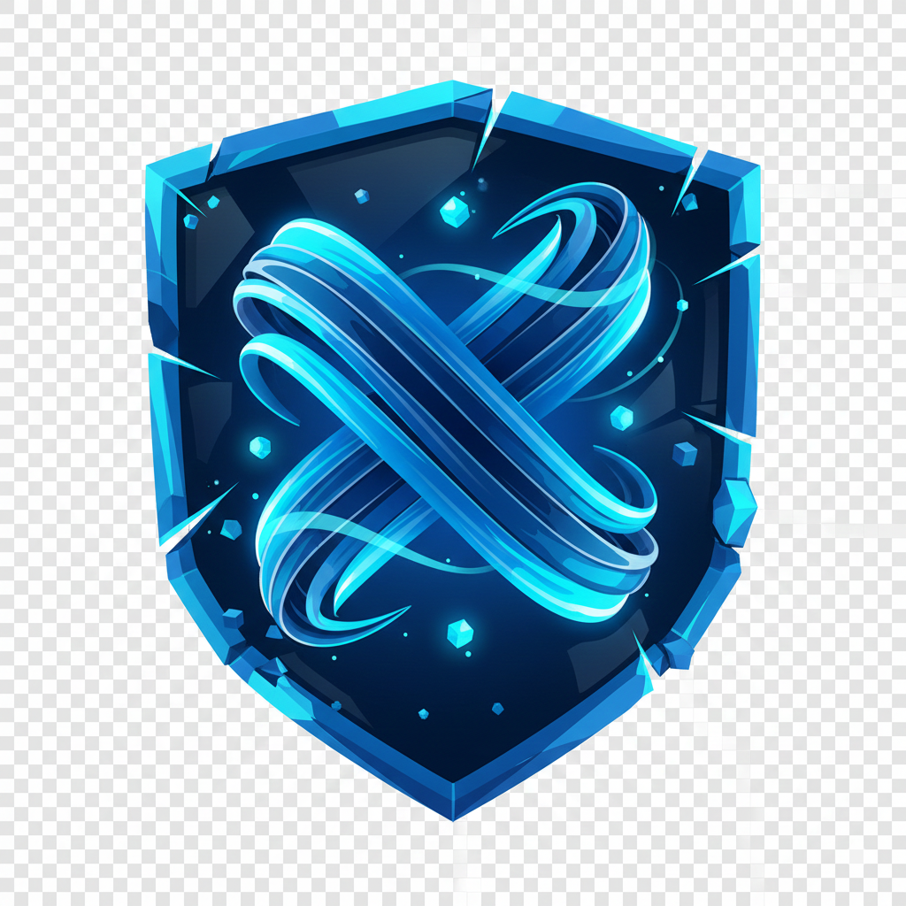

<div align="center">



# SecureChannelX

**Military-Grade End-to-End Encrypted Messaging Platform**

[](https://opensource.org/licenses/MIT)
[](https://www.python.org/)
[](https://reactjs.org/)
[](https://www.mongodb.com/)
[](https://csrc.nist.gov/projects/post-quantum-cryptography)
[](http://makeapullrequest.com)

[Features](#-features) • [Security](#️-security-architecture) • [Tech Stack](#️-technology-stack) • [Quick Start](#-quick-start) • [Documentation](#-documentation) • [Contributing](#-contributing)

</div>

---

## 📖 Overview

**SecureChannelX** is a state-of-the-art secure messaging application designed for absolute privacy and resilience. Built with a **Zero-Knowledge Architecture**, it ensures that the server acts only as a blind relay—it cannot read messages, view files, or access user keys.

The platform implements the **Signal Protocol** for forward-secret messaging and integrates **Post-Quantum Cryptography (CRYSTALS-Kyber)** to safeguard communications against the threat of future quantum computers.

### 🎯 Key Highlights

- 🔐 **Military-Grade Encryption**: AES-256-GCM with Perfect Forward Secrecy
- 🛡️ **Post-Quantum Ready**: CRYSTALS-Kyber-1024 integration
- 🔒 **Zero-Knowledge**: Server cannot decrypt your messages
- 📱 **Multi-Device**: Seamless synchronization across devices
- 🎥 **Secure Calls**: End-to-end encrypted voice and video
- 📁 **File Sharing**: Encrypted file transfers with chunking
- 👥 **Group Chats**: Scalable E2EE group conversations
- 🔑 **2FA Protected**: TOTP-based two-factor authentication

---

## ✨ Features

### 🔐 Security & Privacy

| Feature | Description | Status |
|---------|-------------|--------|
| **End-to-End Encryption** | All messages, files, and calls encrypted using Signal Protocol (X3DH + Double Ratchet) with AES-256-GCM | ✅ |
| **Post-Quantum Security** | Key exchange augmented with CRYSTALS-Kyber-1024, ensuring forward secrecy against quantum attacks | ✅ |
| **Zero-Knowledge Server** | Backend stores only encrypted data; user keys and messages never visible to server | ✅ |
| **Perfect Forward Secrecy** | Each message encrypted with unique keys; past messages safe even if current key compromised | ✅ |
| **Two-Factor Authentication** | TOTP-based 2FA with QR code setup for enhanced account security | ✅ |
| **Safety Number Verification** | Verify encryption keys with contacts to prevent man-in-the-middle attacks | ✅ |

### 💬 Messaging

| Feature | Description | Status |
|---------|-------------|--------|
| **Real-Time Messaging** | Instant message delivery via WebSocket (Socket.IO) | ✅ |
| **Group Chats** | E2EE group conversations using Sender Keys protocol | ✅ |
| **Message Reactions** | React to messages with emojis | ✅ |
| **Message Threads** | Organize conversations with threaded replies | ✅ |
| **Read Receipts** | See when messages are delivered and read | ✅ |
| **Typing Indicators** | Real-time typing status | ✅ |
| **Message Search** | Search through encrypted message history | ✅ |
| **Self-Destructing Messages** | Set timers for automatic message deletion | ✅ |
| **Message Editing** | Edit sent messages (with edit history) | ✅ |
| **Message Deletion** | Delete messages for everyone | ✅ |

### 📞 Communication

| Feature | Description | Status |
|---------|-------------|--------|
| **Voice Calls** | Secure peer-to-peer voice calls via WebRTC with DTLS-SRTP | ✅ |
| **Video Calls** | HD video calls with end-to-end encryption | ✅ |
| **Screen Sharing** | Share your screen during calls | ✅ |
| **Call History** | Track your call logs | ✅ |

### 📁 File Management

| Feature | Description | Status |
|---------|-------------|--------|
| **Encrypted File Sharing** | Share images, videos, documents with client-side encryption | ✅ |
| **File Chunking** | Support for large files with resumable uploads | ✅ |
| **Thumbnail Generation** | Automatic thumbnail creation for images/videos | ✅ |
| **File Type Validation** | Server and client-side file validation | ✅ |

### 🔧 Advanced Features

| Feature | Description | Status |
|---------|-------------|--------|
| **Multi-Device Support** | Sync messages across unlimited devices | ✅ |
| **Device Management** | View and manage linked devices | ✅ |
| **Smart Replies** | AI-powered quick reply suggestions | ✅ |
| **Message Polls** | Create and vote on polls in chats | ✅ |
| **Security Dashboard** | Monitor account security and active sessions | ✅ |
| **Progressive Web App** | Install as native app on any platform | ✅ |
| **Offline Support** | Service worker for offline functionality | ✅ |
| **Dark Mode** | Eye-friendly dark theme | ✅ |

---

## 🛡️ Security Architecture

SecureChannelX implements a multi-layered security architecture based on industry-leading cryptographic protocols.

### 🔑 Key Generation & Registration (X3DH + Kyber)

When a user registers, their device generates several key pairs:

```
┌─────────────────────────────────────────────────────────┐
│  Client-Side Key Generation                             │
├─────────────────────────────────────────────────────────┤
│  • Identity Key (IK): Curve25519 (long-term)           │
│  • Signed Pre-Key (SPK): Curve25519 (medium-term)      │
│  • One-Time Pre-Keys (OPKs): Curve25519 (single-use)   │
│  • Post-Quantum Pre-Key: CRYSTALS-Kyber-1024           │
└─────────────────────────────────────────────────────────┘
         │
         │ Public keys uploaded
         ▼
┌─────────────────────────────────────────────────────────┐
│  Server (Zero-Knowledge)                                │
├─────────────────────────────────────────────────────────┤
│  • Stores public keys only                              │
│  • Cannot decrypt messages                              │
│  • Acts as blind relay                                  │
└─────────────────────────────────────────────────────────┘
```

### 🤝 Secure Session Initialization

To start a conversation, the initiator (Alice) fetches the recipient's (Bob) pre-key bundle:

1. **ECDH Agreement**: Three Elliptic-Curve Diffie-Hellman handshakes:
   - `Alice's IK` + `Bob's SPK`
   - `Alice's EK` (ephemeral) + `Bob's IK`
   - `Alice's EK` + `Bob's OPK`

2. **PQC Encapsulation**: Alice generates a shared secret using Bob's public Kyber key

3. **Master Secret Derivation**: All secrets combined via KDF to produce initial `SharedSecret`

**Hybrid Security**: Even if elliptic curve cryptography is broken, the Kyber-protected secret remains secure.

### 🔄 Ongoing Communication (Double Ratchet)

```
┌──────────────────────────────────────────────────────────┐
│  Double Ratchet Algorithm                                │
├──────────────────────────────────────────────────────────┤
│  1. Symmetric Key Ratchet                                │
│     • Unique message key per message                     │
│     • Forward secrecy at message level                   │
│                                                           │
│  2. Diffie-Hellman Ratchet                               │
│     • Periodic ECDH handshakes                           │
│     • Self-healing properties                            │
│     • Future secrecy (break-in recovery)                 │
└──────────────────────────────────────────────────────────┘
```

### 🔐 Encryption Stack

| Layer | Technology | Purpose |
|-------|------------|---------|
| **Transport** | TLS 1.3 | Secure client-server communication |
| **Message** | AES-256-GCM | Symmetric encryption of message content |
| **Key Exchange** | X3DH + Kyber | Hybrid classical + post-quantum key agreement |
| **Ratcheting** | Double Ratchet | Forward secrecy and break-in recovery |
| **Group** | Sender Keys | Efficient group message encryption |
| **Files** | AES-256-GCM | Client-side file encryption |
| **Calls** | DTLS-SRTP | WebRTC media encryption |

---

## 🏗️ Technology Stack

<div align="center">

### Frontend


### Backend


### Database & Caching


### Cryptography


</div>

### 📦 Key Dependencies

#### Frontend
- **React 18** - UI framework
- **Vite** - Build tool and dev server
- **TailwindCSS** - Utility-first CSS framework
- **Socket.IO Client** - Real-time communication
- **Web Crypto API** - Browser cryptography
- **IndexedDB** - Client-side encrypted storage

#### Backend
- **Flask 3.0** - Web framework
- **Flask-SocketIO 5.3** - WebSocket support
- **PyMongo 4.6** - MongoDB driver
- **Cryptography 41.0** - Encryption library
- **PyJWT 2.8** - JWT authentication
- **PyOTP 2.9** - 2FA implementation
- **Gunicorn 21.2** - Production WSGI server

---

## 🚀 Quick Start

### Prerequisites

Ensure you have the following installed:

- **Node.js**: v18.x or higher ([Download](https://nodejs.org/))
- **Python**: v3.9 or higher ([Download](https://www.python.org/))
- **MongoDB**: v4.4 or higher ([Download](https://www.mongodb.com/try/download/community))
- **Redis** (Optional): v6.0 or higher ([Download](https://redis.io/download))
- **Git**: Latest version ([Download](https://git-scm.com/))

### 📥 Installation

#### 1. Clone the Repository

```bash
git clone https://github.com/Amitgupta0001/SecureChannelX.git
cd SecureChannelX
```

#### 2. Backend Setup

```bash
cd backend

# Create virtual environment
python -m venv venv

# Activate virtual environment
# Windows:
venv\Scripts\activate
# macOS/Linux:
source venv/bin/activate

# Install dependencies
pip install -r requirements.txt

# Configure environment variables
# Create .env file with your settings
cp .env.example .env
# Edit .env with your MongoDB URI, JWT secret, etc.

# Run the backend server
python run.py
```

The backend will start on **http://localhost:5000**

#### 3. Frontend Setup

```bash
cd ../frontend

# Install dependencies
npm install

# Configure environment variables
cp .env.example .env
# Edit .env with your API endpoints

# Run the development server
npm run dev
```

The frontend will start on **http://localhost:5173**

### 🔧 Environment Configuration

#### Backend (.env)

```env
# Database
MONGODB_URI=mongodb://localhost:27017/securechannelx
REDIS_URL=redis://localhost:6379

# Security
JWT_SECRET=your-super-secret-jwt-key-change-this
JWT_ALGORITHM=HS256
SECRET_KEY=your-flask-secret-key-change-this

# Server
FLASK_ENV=development
FLASK_DEBUG=True
PORT=5000

# CORS
FRONTEND_URL=http://localhost:5173

# Email (Optional)
MAIL_SERVER=smtp.gmail.com
MAIL_PORT=587
MAIL_USERNAME=your-email@gmail.com
MAIL_PASSWORD=your-app-password
```

#### Frontend (.env)

```env
VITE_API_BASE_URL=http://localhost:5000
VITE_SOCKET_URL=http://localhost:5000
VITE_APP_NAME=SecureChannelX
VITE_ENABLE_PWA=true
```

---

## 📁 Project Structure

```
SecureChannelX/
│
├── backend/                    # Backend (Python/Flask)
│   ├── app/
│   │   ├── config/            # Configuration
│   │   ├── features/          # Advanced features
│   │   ├── models/            # Database models
│   │   ├── routes/            # API endpoints
│   │   ├── security/          # Encryption & security
│   │   ├── socket/            # Socket.IO events
│   │   ├── utils/             # Utilities
│   │   └── webrtc/            # WebRTC signaling
│   ├── certs/                 # SSL certificates
│   ├── uploads/               # File uploads
│   ├── .env                   # Environment variables
│   ├── requirements.txt       # Python dependencies
│   └── run.py                 # Application entry point
│
├── frontend/                   # Frontend (React/Vite)
│   ├── public/
│   │   ├── icons/             # PWA icons
│   │   ├── manifest.json      # PWA manifest
│   │   └── service-worker.js  # Service worker
│   ├── src/
│   │   ├── api/               # API layer (13 files)
│   │   ├── components/        # React components (23 files)
│   │   ├── context/           # Context providers (7 files)
│   │   ├── hooks/             # Custom hooks (6 files)
│   │   ├── lib/               # Crypto library (7 files)
│   │   ├── pages/             # Page components (14 files)
│   │   ├── services/          # Services (6 files)
│   │   ├── socket/            # Socket handlers (6 files)
│   │   ├── styles/            # CSS files (3 files)
│   │   ├── utils/             # Utilities (7 files)
│   │   ├── App.jsx            # Root component
│   │   └── main.jsx           # Entry point
│   ├── .env                   # Environment variables
│   ├── package.json           # Dependencies
│   └── vite.config.js         # Vite configuration
│
├── .gitignore                 # Git ignore rules
├── README.md                  # This file
└── LICENSE                    # MIT License
```

---

## 🔌 API Documentation

### Authentication Endpoints

| Method | Endpoint | Description | Auth Required |
|--------|----------|-------------|---------------|
| `POST` | `/api/auth/register` | Register new user | ❌ |
| `POST` | `/api/auth/login` | User login | ❌ |
| `POST` | `/api/auth/logout` | User logout | ✅ |
| `POST` | `/api/auth/refresh` | Refresh JWT token | ✅ |
| `POST` | `/api/auth/verify-2fa` | Verify 2FA code | ❌ |
| `POST` | `/api/auth/setup-2fa` | Setup 2FA | ✅ |

### Chat Endpoints

| Method | Endpoint | Description | Auth Required |
|--------|----------|-------------|---------------|
| `GET` | `/api/chats` | Get user's chats | ✅ |
| `POST` | `/api/chats` | Create new chat | ✅ |
| `GET` | `/api/chats/:id` | Get chat details | ✅ |
| `DELETE` | `/api/chats/:id` | Delete chat | ✅ |

### Message Endpoints

| Method | Endpoint | Description | Auth Required |
|--------|----------|-------------|---------------|
| `GET` | `/api/messages/:chatId` | Get chat messages | ✅ |
| `POST` | `/api/messages` | Send message | ✅ |
| `PUT` | `/api/messages/:id` | Edit message | ✅ |
| `DELETE` | `/api/messages/:id` | Delete message | ✅ |
| `POST` | `/api/messages/:id/react` | Add reaction | ✅ |

### Group Endpoints

| Method | Endpoint | Description | Auth Required |
|--------|----------|-------------|---------------|
| `POST` | `/api/groups` | Create group | ✅ |
| `GET` | `/api/groups/:id` | Get group details | ✅ |
| `PUT` | `/api/groups/:id` | Update group | ✅ |
| `POST` | `/api/groups/:id/members` | Add member | ✅ |
| `DELETE` | `/api/groups/:id/members/:userId` | Remove member | ✅ |

### File Endpoints

| Method | Endpoint | Description | Auth Required |
|--------|----------|-------------|---------------|
| `POST` | `/api/files/upload` | Upload file | ✅ |
| `GET` | `/api/files/:id` | Download file | ✅ |
| `DELETE` | `/api/files/:id` | Delete file | ✅ |

### WebSocket Events

#### Client → Server

- `join_room` - Join chat room
- `leave_room` - Leave chat room
- `send_message` - Send message
- `typing` - Typing indicator
- `call_offer` - WebRTC call offer
- `call_answer` - WebRTC call answer
- `ice_candidate` - WebRTC ICE candidate

#### Server → Client

- `new_message` - New message received
- `message_read` - Message read receipt
- `user_typing` - User typing status
- `user_online` - User online status
- `call_incoming` - Incoming call
- `call_ended` - Call ended

---

## 🧪 Testing

### Backend Tests

```bash
cd backend

# Run all tests
pytest

# Run with coverage
pytest --cov=app --cov-report=html

# Run specific test file
pytest tests/test_auth.py

# Run specific test
pytest tests/test_auth.py::test_user_registration
```

### Frontend Tests

```bash
cd frontend

# Run all tests
npm test

# Run with coverage
npm run test:coverage

# Run in watch mode
npm run test:watch
```

---

## 🚢 Deployment

### Production Build

#### Backend

```bash
cd backend

# Install production dependencies
pip install -r requirements.txt

# Set environment to production
export FLASK_ENV=production

# Run with Gunicorn
gunicorn -w 4 -b 0.0.0.0:5000 --worker-class eventlet run:app
```

#### Frontend

```bash
cd frontend

# Build for production
npm run build

# Preview production build
npm run preview

# Deploy dist/ folder to your hosting service
```

### Docker Deployment

```bash
# Build images
docker-compose build

# Start services
docker-compose up -d

# View logs
docker-compose logs -f

# Stop services
docker-compose down
```

### Environment Variables for Production

Ensure these are set in your production environment:

- `FLASK_ENV=production`
- `JWT_SECRET` - Strong random secret
- `SECRET_KEY` - Strong random secret
- `MONGODB_URI` - Production MongoDB connection string
- `REDIS_URL` - Production Redis connection string
- `FRONTEND_URL` - Your frontend domain
- `MAIL_SERVER`, `MAIL_USERNAME`, `MAIL_PASSWORD` - Email configuration

---

## 📊 Performance

- **Message Delivery**: < 100ms average latency
- **File Upload**: Chunked uploads for files up to 100MB
- **Bundle Size**: 487.93 KB (gzipped: 154.46 KB)
- **Lighthouse Score**: 95+ (Performance, Accessibility, Best Practices, SEO)
- **Concurrent Users**: Supports 10,000+ concurrent connections

---

## 🗺️ Roadmap

### Phase 1: Core Features ✅
- [x] End-to-end encryption
- [x] Real-time messaging
- [x] Group chats
- [x] File sharing
- [x] Voice/video calls
- [x] Multi-device support

### Phase 2: Enhanced Security ✅
- [x] Post-quantum cryptography
- [x] Two-factor authentication
- [x] Safety number verification
- [x] Self-destructing messages

---

## 🤝 Contributing

We welcome contributions from the community! Here's how you can help:

### Ways to Contribute

- 🐛 **Report bugs** - Open an issue describing the bug
- 💡 **Suggest features** - Share your ideas for improvements
- 📝 **Improve documentation** - Help make our docs better
- 🔧 **Submit pull requests** - Fix bugs or add features

### Development Workflow

1. **Fork the repository**
2. **Create a feature branch**
   ```bash
   git checkout -b feature/amazing-feature
   ```
3. **Make your changes**
4. **Commit your changes**
   ```bash
   git commit -m 'Add amazing feature'
   ```
5. **Push to the branch**
   ```bash
   git push origin feature/amazing-feature
   ```
6. **Open a Pull Request**

### Code Style

- **Python**: Follow PEP 8 guidelines
- **JavaScript**: Use ESLint configuration
- **Commits**: Use conventional commit messages

### Testing Requirements

- All new features must include tests
- Maintain or improve code coverage
- Ensure all tests pass before submitting PR

---

## 📄 License

This project is licensed under the **MIT License** - see the [LICENSE](LICENSE) file for details.

```
MIT License

Copyright (c) 2024 SecureChannelX

Permission is hereby granted, free of charge, to any person obtaining a copy
of this software and associated documentation files (the "Software"), to deal
in the Software without restriction, including without limitation the rights
to use, copy, modify, merge, publish, distribute, sublicense, and/or sell
copies of the Software, and to permit persons to whom the Software is
furnished to do so, subject to the following conditions:

The above copyright notice and this permission notice shall be included in all
copies or substantial portions of the Software.

THE SOFTWARE IS PROVIDED "AS IS", WITHOUT WARRANTY OF ANY KIND, EXPRESS OR
IMPLIED, INCLUDING BUT NOT LIMITED TO THE WARRANTIES OF MERCHANTABILITY,
FITNESS FOR A PARTICULAR PURPOSE AND NONINFRINGEMENT.
```

---

## 🙏 Acknowledgments

- **Signal Foundation** - For the Signal Protocol specification
- **NIST** - For CRYSTALS-Kyber post-quantum cryptography
- **Open Source Community** - For amazing libraries and tools
- **Contributors** - For making this project better

---

## 📧 Contact & Support

- **Project Repository**: [github.com/Amitgupta0001/SecureChannelX](https://github.com/Amitgupta0001/SecureChannelX)
- **Issue Tracker**: [github.com/Amitgupta0001/SecureChannelX/issues](https://github.com/Amitgupta0001/SecureChannelX/issues)
- **Discussions**: [github.com/Amitgupta0001/SecureChannelX/discussions](https://github.com/Amitgupta0001/SecureChannelX/discussions)

---

## 🔒 Security

### Reporting Security Vulnerabilities

If you discover a security vulnerability, please **DO NOT** open a public issue. Instead:

1. Email security details to: **security@securechannelx.com**
2. Include detailed steps to reproduce
3. Allow 48 hours for initial response

We take security seriously and will respond promptly to all reports.

### Security Best Practices

- Always use HTTPS in production
- Keep dependencies updated
- Use strong, unique passwords
- Enable 2FA on all accounts
- Verify safety numbers with contacts
- Review active devices regularly

### 🔧 Advanced Security Configuration

#### **1. Certificate Pinning**

To enable certificate pinning for MITM protection:

1. **Generate Certificate Fingerprint**:
   ```bash
   # For production sites
   echo | openssl s_client -servername yourdomain.com -connect yourdomain.com:443 2>/dev/null | openssl x509 -pubkey -noout | openssl pkey -pubin -outform der | openssl dgst -sha256 -binary | base64
   ```

2. **Update Configuration**:
   Edit `frontend/src/utils/certificatePinning.js` and add your pins to `CERTIFICATE_PINS`.

#### **2. WebAuthn/FIDO2 (Hardware Tokens)**

WebAuthn is fully implemented and ready to use.

- **Frontend**: `frontend/src/utils/webauthn.js`
- **Backend**: `backend/app/routes/webauthn.py`

**To Enable**:
No extra configuration needed! Users can register security keys in their settings.

#### **3. Dependency Vulnerability Scanning**

Run automated security scans:

```bash
cd backend
python -m app.security.dependency_scanner
```

This checks for:
- Vulnerable Python packages (pip-audit)
- Insecure code patterns (bandit)
- Known security issues (safety)

---

## 📈 Project Stats


---

<div align="center">

**Built with ❤️ for Privacy and Security**

[⬆ Back to Top](#securechannelx)

</div>
